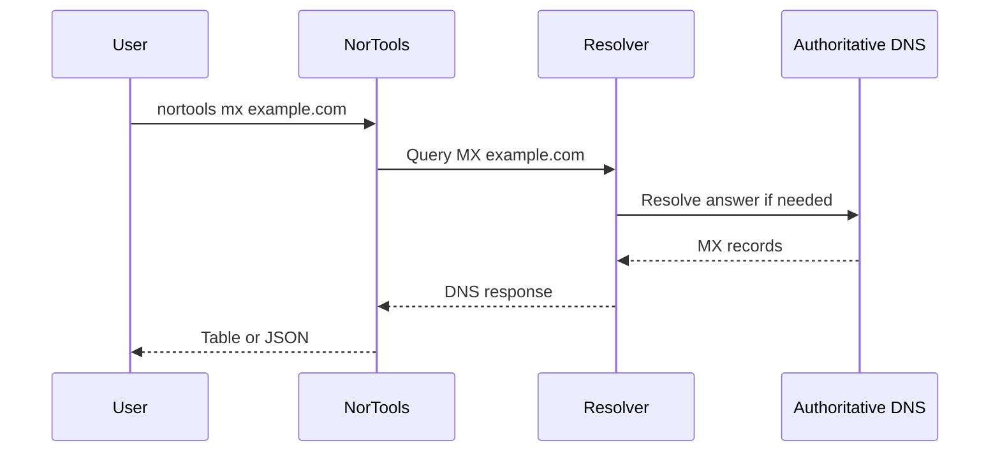

# DNS Records

DNS maps names to information. NorTools exposes direct record lookups so you can ask one precise question at a time.

## Common Records

- `A`: IPv4 address.
- `AAAA`: IPv6 address.
- `MX`: mail exchangers.
- `TXT`: text metadata such as SPF and verification records.
- `CNAME`: alias to another name.
- `NS`: authoritative nameservers.
- `SOA`: zone authority and serial data.
- `SRV`: service location.
- `PTR`: reverse DNS name.

## For Network Engineers

Use explicit record types during incident work. `ANY` responses are inconsistent across resolvers and should not be used as a full inventory.
