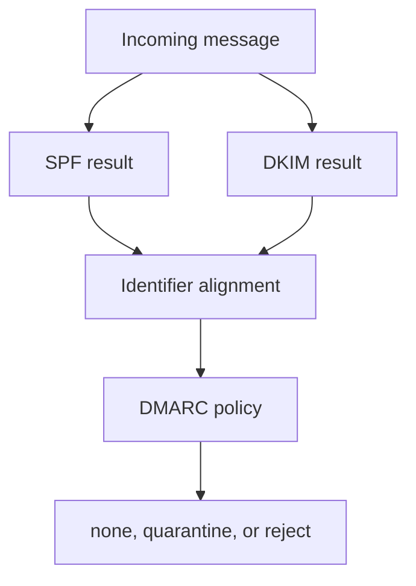

# Email Authentication

Email authentication answers three questions:

- Is this sending IP allowed? SPF.
- Was this message signed by the domain? DKIM.
- Do SPF or DKIM align with the visible From domain? DMARC.



## Use NorTools

```bash
nortools spf example.com
nortools dkim --discover example.com
nortools dmarc example.com
nortools deliverability example.com
```

## For Network Engineers

Use `header-analyzer` to inspect actual message results, and use DNS tools to inspect published policy. DMARC aggregate reports show what receivers observed at scale.
