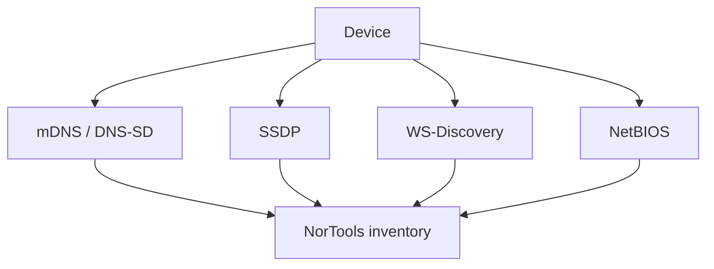

# Local Discovery

Local discovery protocols let devices announce or find services on the same network.

## Use NorTools

Use ZeroConf Discovery in the UI for a combined local inventory. Use individual CLI tools when you want one protocol at a time.

## For Network Engineers

Local discovery results are best-effort. Firewalls, VLANs, multicast filtering, and host sleep states can all hide devices.
