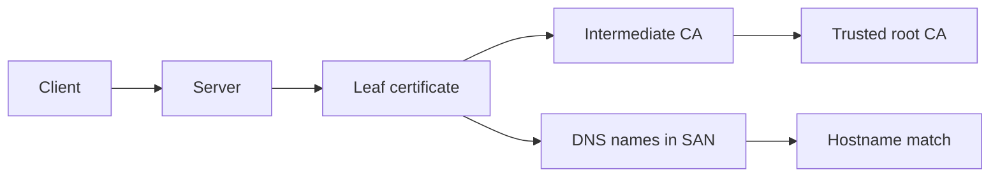

# TLS Certificates

TLS certificates prove that a server can present a certificate for the name you connected to.



## Use NorTools

```bash
nortools https example.com
```

The HTTPS UI shows the certificate chain, SNI behavior, ALPN, hostname matching, and findings.

## For Network Engineers

Check the leaf certificate first, then intermediates, hostname matching, expiration, key size, signature algorithm, and whether SNI changes the served certificate.
