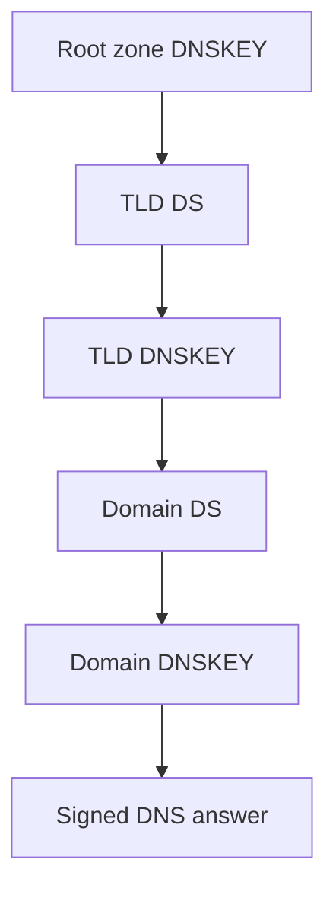

# DNSSEC Tools

DNSSEC tools inspect records used to authenticate DNS answers.

## Quick Commands

```bash
nortools dnskey cloudflare.com
nortools ds cloudflare.com
nortools rrsig cloudflare.com
nortools nsec cloudflare.com
nortools nsec3param cloudflare.com
```

## In The UI

UI path: Home -> DNSSEC Lookup

Use DNSSEC Lookup for direct record checks. Use the DNSSEC chain UI when you need to understand delegation from the root to a domain.

## DNSSEC Chain

The chain links parent DS records to child DNSKEY records.



## For Network Engineers

Use these tools when diagnosing bogus, insecure, or missing DNSSEC states. Check DS/DNSKEY algorithm support, key tags, RRSIG validity windows, and NSEC/NSEC3 denial behavior.
