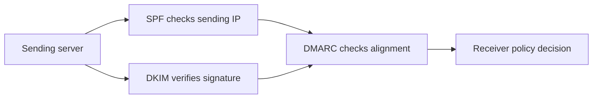

# Email Tools

Email tools help diagnose authentication, delivery policy, SMTP TLS, and message headers.

## Quick Commands

```bash
nortools spf example.com
nortools dkim --discover example.com
nortools dkim selector1 example.com
nortools dmarc example.com
nortools bimi example.com
nortools smtp example.com
nortools mta-sts example.com
nortools tlsrpt example.com
nortools header-analyzer headers.txt
```

## In The UI

UI paths: Home -> SPF, DKIM, DMARC, or Domain Health.

Domain Health combines many mail checks into one report.

## How Email Authentication Fits Together



## For Network Engineers

Use `deliverability`, `compliance`, and `mailflow` when you need composite mail diagnostics. Use individual SPF/DKIM/DMARC tools when you want to inspect one policy at a time.
