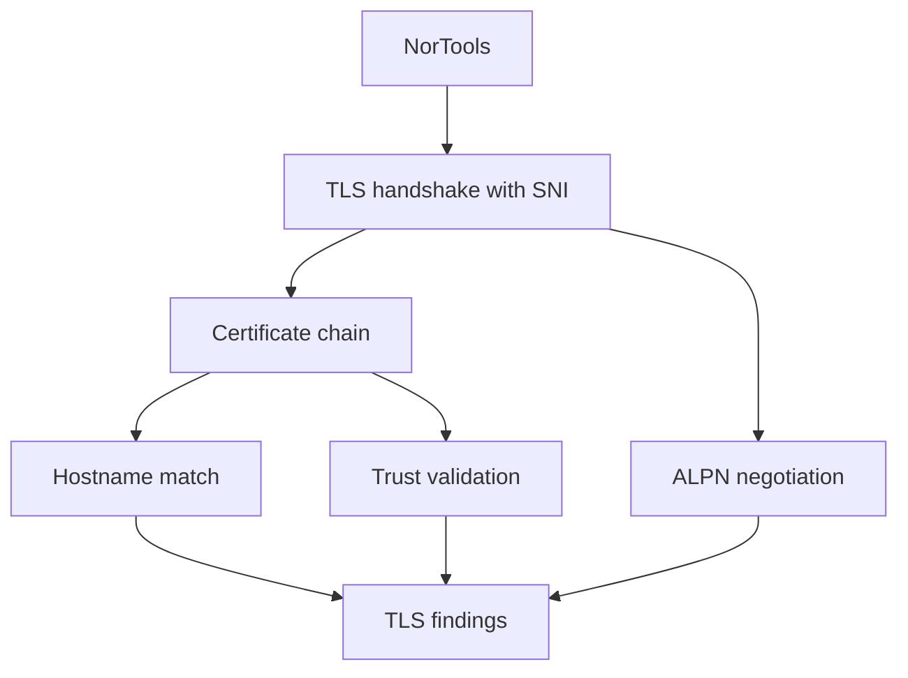

# Network Tools

Network tools inspect explicit hosts, URLs, and endpoints.

## Quick Commands

```bash
nortools tcp example.com 443
nortools http http://example.com
nortools https example.com
nortools ping example.com
nortools trace example.com
```

## In The UI

UI paths: Home -> HTTP Check, HTTPS / SSL, Ping, Traceroute, Interfaces & Routing, or iperf3 Throughput.


## TLS Validation Flow



## For Network Engineers

`https` checks SNI behavior, ALPN, hostname matching, certificate details, and redirect chains in the UI. Use JSON output when capturing evidence.
