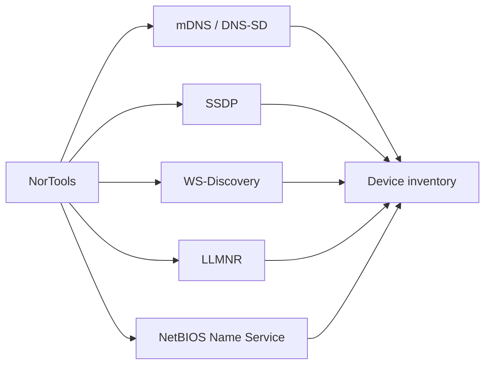

# ZeroConf And Local Discovery Tools

ZeroConf tools help understand devices and services on the local network.

## Quick Commands

```bash
nortools mdns --query _services._dns-sd._udp.local --type PTR
nortools llmnr --query hostname
nortools netbios-ns --query MYPC
nortools ssdp --search
nortools ws-discovery --probe
nortools samba-browse 192.168.1.25
```

## In The UI

UI paths: Home -> ZeroConf Discovery, or Home -> Samba Browse.


## Discovery Flow



## For Network Engineers

These tools use local multicast or broadcast protocols. Keep queries bounded and use them only on networks where you are allowed to inspect local discovery traffic.
