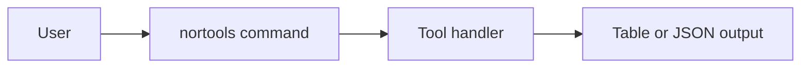

# GitHub Pages Documentation Site Plan

## Existing Coverage

NorTools already has useful raw material:

- `README.md` lists many CLI commands and release/build information.
- `RFC.md` maps tools to relevant standards.
- `docs/screenshots` contains desktop UI screenshots.
- `cli_native/smoke/args/*.args` contains executable-style command examples using `nortools <command>`.
- `cli_native/smoke/test_names.bzl` is a current list of many native CLI smoke-tested commands.
- `web/src/main/kotlin/no/norrs/nortools/web/WebPortal.kt` lists UI routes and API routes.
- `web/src/main/resources/vue/components/*.vue` contains page names and UI behavior.

Missing pieces:

- No GitHub Pages workflow.
- No dedicated end-user documentation site.
- README examples are developer-oriented in several places because they use `bazelisk run`.
- CLI usage and UI usage are not documented together per tool.
- There is no single, searchable tool catalog for both beginners and experienced network engineers.

## Goal

Build a static documentation site published to GitHub Pages that helps users answer:

- What tool should I use?
- What command do I run with the released executable?
- Where is the same feature in the desktop/web UI?
- What does the result mean?
- What should I try next when the output looks wrong?

The docs should serve two audiences on the same page:

- Beginners: plain-language explanation, safe defaults, copy/paste examples.
- Network engineers: flags, JSON mode, protocol notes, relevant RFCs, output fields, edge cases.

## Recommended Site Stack

Use VitePress under `docs-site/`.

Reasoning:

- The repo already uses `pnpm`.
- VitePress is Markdown-first and lightweight.
- It builds static HTML suitable for GitHub Pages.
- It can include generated Markdown pages from scripts.
- It can render Mermaid diagrams through a Markdown/VitePress plugin.
- It avoids mixing publishable user docs with `docs/todo-plans` and `docs/archived-plans`.

Suggested layout:

```text
docs-site/
  package.json
  docs/
    .vitepress/
      config.ts
      theme/
    index.md
    getting-started/
      install.md
      desktop-ui.md
      command-line.md
      json-output.md
    tools/
      index.md
      dns/
      dnssec/
      email/
      network/
      zeroconf/
      whois/
      security/
      utility/
      composite/
    concepts/
      dns-records.md
      email-authentication.md
      tls-certificates.md
      local-discovery.md
    troubleshooting/
      dns.md
      email.md
      tls.md
      desktop.md
    reference/
      cli.md
      ui-routes.md
      standards.md
      changelog.md
  scripts/
    generate-tool-reference.mjs
```

## Mermaid Diagram Support

The documentation site must support Mermaid diagrams in Markdown. Use this for diagrams that explain flows and relationships more clearly than prose:

- DNS lookup flow from user input to resolver response.
- DNSSEC chain of trust.
- SMTP delivery and STARTTLS flow.
- SPF/DKIM/DMARC alignment.
- TLS certificate chain and validation steps.
- Zeroconf discovery protocol flow.
- Domain health/composite check dependency graphs.
- Desktop app architecture: native wrapper, embedded web server, Vue UI, CLI tools.

Implementation requirements:

- Add a VitePress-compatible Mermaid renderer, for example `vitepress-plugin-mermaid` or an equivalent maintained plugin.
- Configure Mermaid in `docs-site/docs/.vitepress/config.ts`.
- Support light and dark themes.
- Ensure diagrams are accessible:
  - Provide a short text summary before or after each diagram.
  - Do not rely on color alone to communicate state.
  - Keep node labels readable on mobile.
- Keep diagram source in Markdown using fenced code blocks:

````md

````

- Avoid huge diagrams on individual tool pages. Put larger architecture diagrams under `concepts/` or `reference/`.
- Mermaid diagrams should be reviewed like code because syntax errors can break the page render.

## Documentation Principles

- Primary command examples should use the released executable form:

```bash
nortools mx example.com
nortools mx --json example.com
```

- Developer fallback examples may exist, but only in a contributor note:

```bash
bazelisk run //tools/dns/mx -- example.com
```

- Every tool page should explain the UI path:

```text
Desktop UI: DNS Lookup -> MX
Web route: /dns
```

- Every page should avoid assuming users know protocol jargon.
- Every page should include a short "For network engineers" section.
- Every page should clearly mark operations that contact public services or local network services.
- Do not document workflows that imply port scanning or broad unauthorized probing.

## Tool Page Template

Each tool page should use the same structure:

```md
# MX Lookup

## Use This When

Plain-language scenarios.

## Quick Command

Copy/paste executable examples.

## In The UI

Steps from the desktop/web UI, with screenshot where useful.

## Example Output

Short sample table and JSON sample.

## What The Result Means

Beginner interpretation first.

## For Network Engineers

RFC notes, protocol details, flags, JSON fields, limits, edge cases.

## Common Problems

NXDOMAIN, timeout, no records, DNSSEC, resolver differences.

## Related Tools

Links to adjacent NorTools pages.
```

## Information Architecture

1. Home page.
   - Search-first tool catalog.
   - "I need to..." task cards:
     - Check a domain's DNS.
     - Debug email delivery.
     - Inspect HTTPS/TLS.
     - Discover local devices.
     - Calculate a subnet.
     - Generate DNS/email records.

2. Getting Started.
   - Install desktop app.
   - Run CLI executable.
   - Understand `--json`.
   - Choose custom DNS resolver.
   - Understand timeouts.

3. Tool Catalog.
   - DNS lookup tools.
   - DNSSEC tools.
   - Email authentication tools.
   - Email infrastructure tools.
   - Network tools.
   - Zero-configuration discovery tools.
   - WHOIS/RDAP/ASN tools.
   - Blocklist and security DNS tools.
   - Utility tools.
   - Composite report tools.

4. Concepts.
   - Short explainers for users who do not already know DNS, SPF, DKIM, DMARC, TLS, CIDR, mDNS, etc.
   - Keep these pages practical and linked from tool pages.

5. Troubleshooting.
   - Common failure modes and what to run next.
   - "No records found" versus "query failed".
   - Local firewall prompts.
   - DNS resolver differences.
   - Native app update problems.

6. Reference.
   - Complete CLI command list.
   - Full UI route list.
   - Standards/RFC mapping generated from `RFC.md` or maintained beside it.

## Initial Tool Inventory

Generate or manually seed pages for all current command/UI families:

- DNS: `a`, `aaaa`, `cname`, `mx`, `ns`, `ptr`, `soa`, `srv`, `txt`.
- DNSSEC: `dnskey`, `ds`, `rrsig`, `nsec`, `nsec3param`, DNSSEC chain UI.
- Email auth: `spf`, `dkim`, `dmarc`, `bimi`, `spf-generator`, `dmarc-generator`.
- Email infrastructure: `smtp`, `mta-sts`, `tlsrpt`, `header-analyzer`.
- Network: `tcp`, `http`, `https`, `ping`, `trace`, `iperf` when finalized.
- ZeroConf/local discovery: `mdns`, `llmnr`, `netbios-ns`, `ssdp`, `ws-discovery`, `samba-browse`, ZeroConf Discovery UI.
- WHOIS/RDAP/ASN: `whois`, `arin`, `asn`, RPKI route UI.
- Blocklist/security DNS: `blacklist`, `blocklist`, `cert`, `loc`, `ipseckey`.
- Utilities: `whatismyip`, `subnet-calc`, `password-gen`, `email-extract`, `dns-propagation`, `dns-health`.
- Composite: `domain-health`, `deliverability`, `compliance`, `dmarc-report`, `mailflow`, `bulk`.

The generator should compare these sources and fail CI if they diverge:

- `tools/**/BUILD.bazel`
- `cli_native/smoke/args/*.args`
- `web/src/main/kotlin/no/norrs/nortools/web/WebPortal.kt`
- `RFC.md`

## Generated Reference Data

Add `docs-site/scripts/generate-tool-reference.mjs`.

Inputs:

- CLI smoke args for executable examples.
- `README.md` command descriptions as a temporary source.
- `RFC.md` standards mapping.
- `WebPortal.kt` route declarations.
- Optional frontmatter files for human-written descriptions.

Outputs:

- `docs-site/docs/reference/cli.md`
- `docs-site/docs/reference/ui-routes.md`
- Starter pages under `docs-site/docs/tools/generated/` or data JSON consumed by hand-authored pages.

Rule:

- Generated command snippets are allowed.
- Human explanation should stay hand-authored so beginner docs remain readable.

## CLI Documentation Requirements

Each CLI page must include:

- Executable command:
  - `nortools <command> ...`
- JSON variant:
  - `nortools <command> --json ...`
- Common options:
  - `--json`
  - `--server`
  - `--timeout`
  - command-specific flags.
- Exit behavior and common errors.
- What network traffic the command sends.
- Example use cases:
  - beginner copy/paste.
  - realistic engineer scenario.
- Related commands.

## UI Documentation Requirements

Each UI page must include:

- Navigation path from the desktop app home screen.
- Direct web route when applicable.
- Input fields explained in plain language.
- Button behavior.
- Result sections explained.
- Screenshot or short animated capture where it materially helps.
- Mapping to equivalent CLI command.

Example:

```md
UI path: Home -> HTTPS / SSL
Equivalent CLI: `nortools https example.com`
```

## Screenshot Strategy

- Reuse `docs/screenshots` for overview pages.
- Add focused screenshots for pages where the UI has multiple tabs or non-obvious result sections.
- Use existing screenshot automation where possible:
  - `script/release/capture_desktop_screenshots.py`
  - release screenshot workflows.
- Store site-specific screenshots under `docs-site/docs/public/screenshots` or import from `docs/screenshots` during build.
- Add alt text for every screenshot.

## GitHub Pages Workflow

Add `.github/workflows/docs-site.yml`.

Workflow behavior:

1. Trigger on pushes to `main` that touch:
   - `docs-site/**`
   - `docs/screenshots/**`
   - `README.md`
   - `RFC.md`
   - `web/src/main/kotlin/no/norrs/nortools/web/WebPortal.kt`
   - `cli_native/smoke/**`
2. Install Node with pnpm.
3. Run docs generation.
4. Run link checks and markdown lint.
5. Validate Mermaid diagrams.
6. Build VitePress static site.
7. Upload Pages artifact.
8. Deploy with GitHub Pages actions.

Use GitHub's Pages deployment flow rather than pushing generated files to a checked-in `gh-pages` branch unless there is a specific repository reason to keep that branch.

## Quality Gates

Add CI checks:

- Every CLI smoke command has a docs entry.
- Every public UI route has a docs entry or is explicitly marked internal.
- Every tool page has:
  - quick command,
  - UI path or "CLI only",
  - beginner explanation,
  - engineer notes,
  - related tools.
- No broken internal links.
- No references to `bazelisk run` in end-user quick-start snippets except in developer-only pages.
- Screenshots referenced by docs exist.
- Mermaid diagrams parse successfully and render in the built static site.

## Implementation Steps

1. Create `docs-site` with VitePress.
   - Add package scripts:
     - `docs:dev`
     - `docs:generate`
     - `docs:build`
     - `docs:check`
   - Add Mermaid rendering support.
   - Add a Mermaid validation step to `docs:check`.

2. Create base site structure.
   - Home.
   - Getting Started.
   - Tool Catalog.
   - Concepts.
   - Troubleshooting.
   - Reference.

3. Build the tool inventory generator.
   - Parse smoke arg files into executable examples.
   - Parse route declarations from `WebPortal.kt`.
   - Emit reference pages and a JSON inventory.

4. Write the first complete category manually.
   - Recommended first category: DNS lookup tools.
   - Use it as the page-quality standard for all other categories.

5. Add UI documentation for existing screenshots.
   - Home.
   - DNS Lookup.
   - HTTP Check.
   - HTTPS / SSL.
   - Subnet Calculator.
   - Password Generator.
   - Traceroute.
   - Interfaces & Routing.
   - WHOIS Lookup.
   - DNS Health.
   - Domain Health.
   - ZeroConf Discovery.
   - Samba Browse.

6. Add initial Mermaid diagrams.
   - DNS lookup request/response flow.
   - DNSSEC chain of trust.
   - SMTP authentication and delivery flow.
   - TLS certificate validation flow.
   - Zeroconf discovery flow.

7. Add the Pages workflow.
   - Build on PR.
   - Deploy on `main`.
   - Document repository Pages settings if manual setup is needed.

8. Add docs contribution guide.
   - New tool checklist.
   - Tool page template.
   - Mermaid diagram style and validation rules.
   - Screenshot update process.
   - How to run local docs site.

9. Add release integration.
   - For each release, publish docs with the release version and link to latest downloads.
   - Optional later milestone: versioned docs for older releases.

## Acceptance Criteria

- `pnpm --dir docs-site docs:build` creates a static site.
- GitHub Actions deploys the site to GitHub Pages.
- The site has end-user pages for every current tool category.
- At least one complete page exists for every current CLI command.
- Each UI page maps to an equivalent CLI command where one exists.
- Mermaid diagrams render correctly in local and GitHub Pages builds.
- The docs are readable by beginners without hiding engineer-level details.
- Generated command references use `nortools <command>`, not Bazel developer commands.
